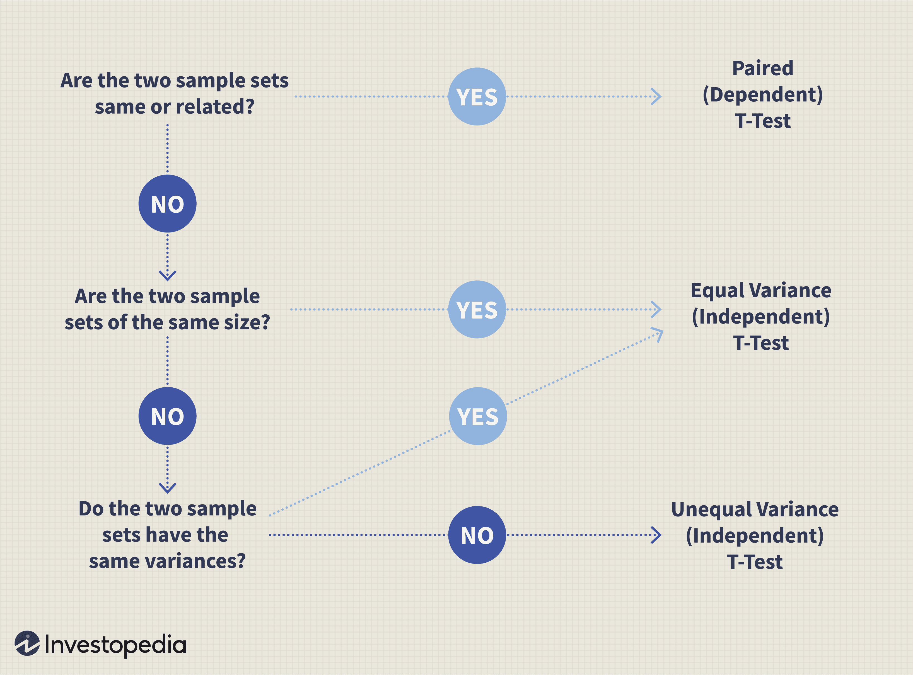

# Images

## T-test flowchart

https://www.investopedia.com/terms/t/t-test.asp

* Assume standard deviation is unknown
* Best performed when an experiment has a small sample size

## Z-tests

* Assume standard deviation is KNOWN
* Can be used to test a hypotheses in which the z-test follows a normal distribution

## Kolmogorov–Smirnov test
Some practical reasons for reconsidering the Kolmogorov‐Smirnov test
RR Wilcox - British Journal of Mathematical and Statistical …, 1997 - Wiley Online Library
67

Normality tests for statistical analysis: a guide for non-statisticians
A Ghasemi, S Zahediasl - International journal of endocrinology …, 2012 - ncbi.nlm.nih.gov
2037

The Kolmogorov-Smirnov test for goodness of fit
FJ Massey Jr - Journal of the American statistical Association, 1951 - Taylor & Francis
4612

Simulation modeling and Arena
MD Rossetti - 2015 - books.google.com
216

Introduction to monte carlo simulation
S Raychaudhuri - 2008 Winter simulation conference, 2008 - ieeexplore.ieee.org
313

Stochastic simulation
BD Ripley - 2009 - books.google.com
3023

