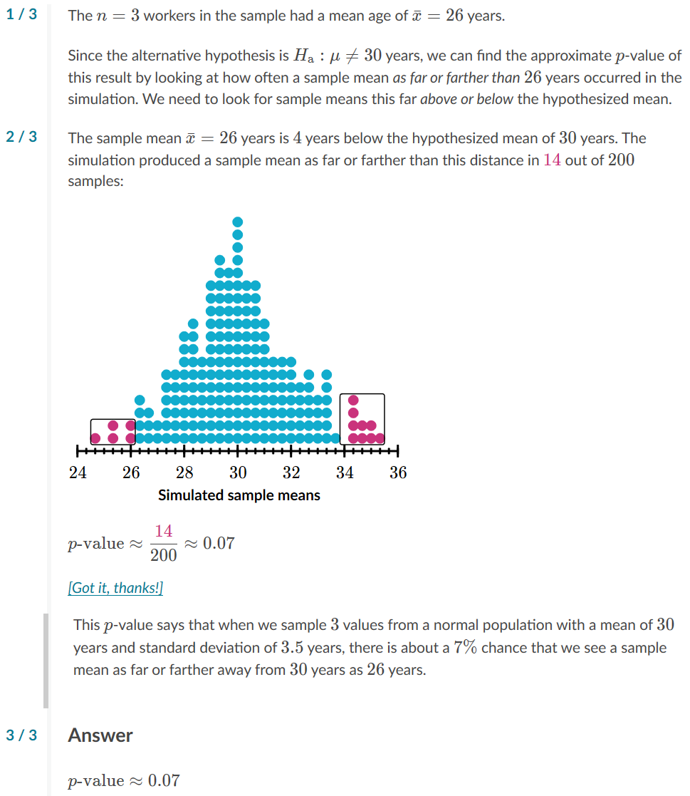

# All examples
https://www.khanacademy.org/math/ap-statistics/tests-significance-ap/idea-significance-tests/e/estimating-p-values-and-making-conclusions

  1. [worker age](#q1-worker-age)
  2. [cholesterol](#q2-company-personnel-cholesterol)
  3. [height](#q3-teenager-height)
  4. [foot length](#q4-teenager-foot-length)
  5. [conclusions](#5-using-p-values-to-make-conclusions)

# Examples
## Q1) Worker Age
The ages of workers ina certain industry are apporximately normally distributed
with a mean of 30 years and a standard deviation of 3.5 years.

A recruiter wondered if that held true for workers in a certain state.
The recruiter took a random sample of n=3 of these workers from the state,
and the mean age of the workers in the samople was 26 years.

### [Question](README_all.md)

### Answer

## Q2) Company personnel Cholesterol
Test Ho: mean=4.6 mmol/L v Ha:mean<4.6 mmol/L

### [Question](README_all.md)

### Answer

## Q3) Teenager height

### [Question](README_all.md)

### Answer

## Q4) Teenager foot length

### [Question](README_all.md)

### Answer

## 5) Using P-values to make conclusions
https://www.khanacademy.org/math/ap-statistics/tests-significance-ap/idea-significance-tests/a/p-value-conclusions

### Comparing pvalues to significance level, alpha
we compare the p-value to a significance level α to make conclusions about our hypotheses.

If the p-value is lower than the significance level we chose,
then we reject the null hypotheses Ho
in favor of the alternative hypothesis Ha.

If the p-value is greater than or equal to the significance level,
then we fail to reject the null hypothesis Ho — 
this doesn't mean we accept Ho.

  * p-value < alpha => reject Ho => accept Ha
  * p-value >= alpha => fail to reject Ho

### [Example 1](README.md)
Alessandra designed an experiment where subjects tasted water from four different cups and attempted to identify which cup contained bottled water. Each subject was given three cups that contained regular tap water and one cup that contained bottled water (the order was randomized). She wanted to test if the subjects could do better than simply guessing when identifying the bottled water. 

Her hypotheses were:
  * Ho: *p* = 0.25
  * Ha: *p* > 0.25
(where *p* is the true likelihood of these subjects identifying the bottled water).

The experiment showed that 20 of the 60 subjects correctly identified the bottle water.
Alessandra calculated that the true likelihood statistic *p_hat* = 20/60 = 0.3333
had an associated P-value of approximately 0.068

#### What conclusion should be made using a significance level of alpha = 0.05?
  * Fail to reject Ho
  * Reject Ho and accept Ha
  * Accept Ha

##### Fail to reject Ho
**CORRECT**: Since the p-value of 0.068 is greater than alpha = 0.05, we should fail to reject Ho.

##### Reject Ho and accept Ha
We should only reject Ho if the pvalue is less than the significancne level, alpha, and this pvalue is greater than alpha (0.068 > 0.05)

##### Accept Ho
We should never accept the null hypothesis Ho in our conclusion of a significance test.

#### What does this conclusion say?
  * N: The evidence suggests that these subjects can do better than guessing when identifying the bottled water.
  * Y: We don't have enough evidence to say that these subjects can do better than guessing when identifying the bottled water.
  * N: The evidence suggests that these subjects were simply guessing when identifying the bottled water.

##### N: Subjects know which is bottled water
The evidence suggests that these subjects can do better than guessing when identifying the bottled water.

This is the conclusion we would make if our pval was low enough to reject Ho and accept Ha:  p > 0.25, but we failed to reject Ho.

##### Y: Not enough evidence
We don't have enough evidence to say that these subjects can do better than guessing when identifying the bottled water.

The null hypothesis Ho: p=0.25 says their likelihood is no better than guessing, ans we failed to reject the null hypothesis.

##### N: They are just guessing
The evidence suggests that these subjects were simply guessing when identifying the bottled water.

There wasn't enough evidence to reject Ho at this significance level, 
but that doesn't mean we should accept Ho.
This experiment didn't attempt to collect evidence in support of Ho.
