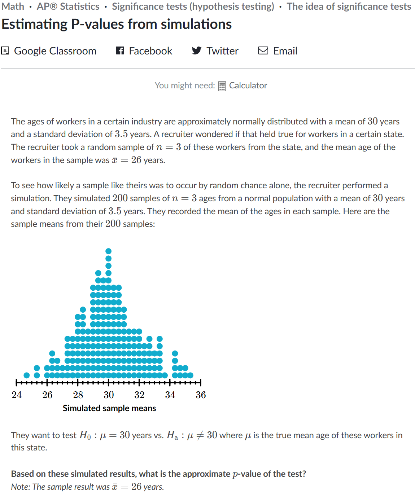
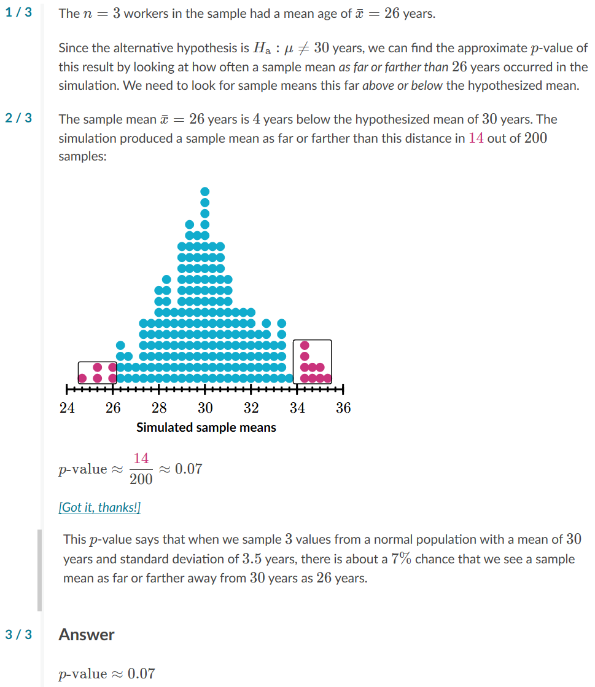

# Example 1
https://www.khanacademy.org/math/ap-statistics/tests-significance-ap/idea-significance-tests/e/estimating-p-values-and-making-conclusions

## [Question](README.md)

## Answer

## Text
### Question
The ages of workers in a certain industry are approximately normally distributed with a mean of 
3030
30
30
 years and a standard deviation of 
3.53.5
3.5
3, point, 5
 years. A recruiter wondered if that held true for workers in a certain state. The recruiter took a random sample of 
n=3n=3
n=3
n, equals, 3
 of these workers from the state, and the mean age of the workers in the sample was 
xˉ=26\bar x=26
x
ˉ
=26
x, with, \bar, on top, equals, 26
 years.
To see how likely a sample like theirs was to occur by random chance alone, the recruiter performed a simulation. They simulated 
200200
200
200
 samples of 
n=3n=3
n=3
n, equals, 3
 ages from a normal population with a mean of 
3030
30
30
 years and standard deviation of 
3.53.5
3.5
3, point, 5
 years. They recorded the mean of the ages in each sample. Here are the sample means from their 
200200
200
200
 samples:

### Answer
Choose 1 answer:

(Choice A, Incorrect)

Incorrect
p-value≈0.025p\text{-value}\approx 0.025
p-value≈0.025
p, start text, negative, v, a, l, u, e, end text, approximately equals, 0, point, 025

(Choice B, Incorrect)

Incorrect
p-value≈0.05p\text{-value}\approx 0.05
p-value≈0.05
p, start text, negative, v, a, l, u, e, end text, approximately equals, 0, point, 05

(Choice C, Checked, Correct)

Correct (selected)
p-value≈0.07p\text{-value}\approx 0.07
p-value≈0.07
p, start text, negative, v, a, l, u, e, end text, approximately equals, 0, point, 07
The sample mean was 
44
4
4
 years below the hypothesized mean, and 
1414
14
14
 of the 
200200
200
200
 simulated results were this far or farther above or below the hypothesized mean.

(Choice D, Incorrect)

Incorrect
p-value≈0.14p\text{-value}\approx 0.14
p-value≈0.14
p, start text, negative, v, a, l, u, e, end text, approximately equals, 0, point, 14

Hint #1
1 / 3
The 
n=3n=3
n=3
n, equals, 3
 workers in the sample had a mean age of 
xˉ=26\bar x=26
x
ˉ
=26
x, with, \bar, on top, equals, 26
 years.
Since the alternative hypothesis is 
Ha:μ≠30H_\text{a}:\mu \neq 30
H
a
​

:μ

​

=30
H, start subscript, start text, a, end text, end subscript, colon, mu, does not equal, 30
 years, we can find the approximate 
pp
p
p
-value of this result by looking at how often a sample mean as far or farther than 
2626
26
26
 years occurred in the simulation. We need to look for sample means this far above or below the hypothesized mean.
Hint #2
2 / 3
The sample mean 
xˉ=26\bar x=26
x
ˉ
=26
x, with, \bar, on top, equals, 26
 years is 
44
4
4
 years below the hypothesized mean of 
3030
30
30
 years. The simulation produced a sample mean as far or farther than this distance in 
14\maroonD{14}
14
start color #ca337c, 14, end color #ca337c
 out of 
200200
200
200
 samples:

2424
24
2626
26
2828
28
3030
30
3232
32
3434
34
3636
36
Simulated sample means
p-value≈14200≈0.07p\text{-value} \approx \dfrac{\maroonD{14}}{200} \approx 0.07
p-value≈
200

14
​

≈0.07
p, start text, negative, v, a, l, u, e, end text, approximately equals, start fraction, start color #ca337c, 14, end color #ca337c, divided by, 200, end fraction, approximately equals, 0, point, 07
[Got it, thanks!]
This 
pp
p
p
-value says that when we sample 
33
3
3
 values from a normal population with a mean of 
3030
30
30
 years and standard deviation of 
3.53.5
3.5
3, point, 5
 years, there is about a 
7%7\%
7%
7, percent
 chance that we see a sample mean as far or farther away from 
3030
30
30
 years as 
2626
26
26
 years.
