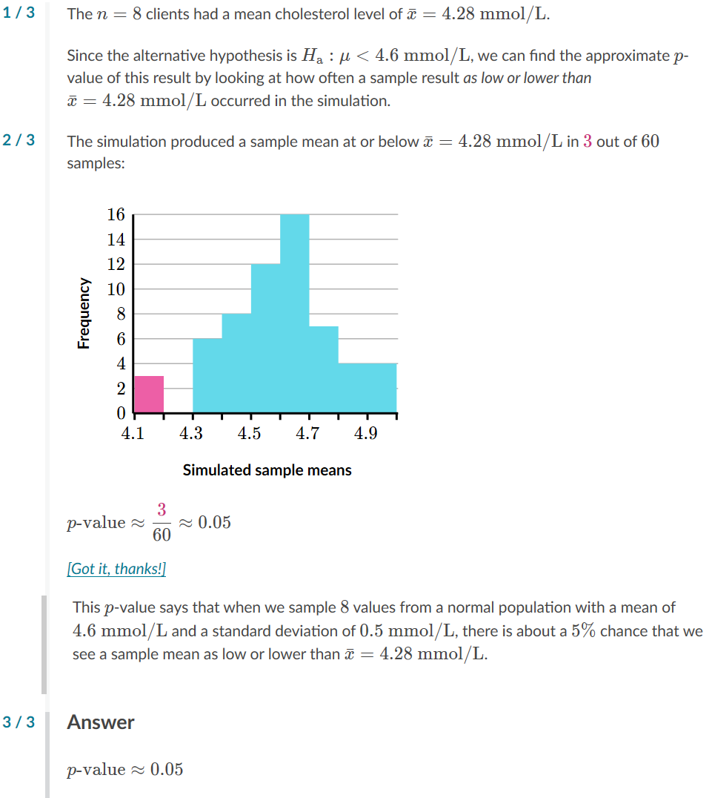

# Company personnel Cholesterol
Test Ho: mean=4.6 mmol/L v Ha:mean<4.6 mmol/L

## Question

## Answer

## Text
### Question
A nutritionist suspected that her company's clients had below average cholesterol. They obtained a random sample of 
88
8
8
 clients of the same age and gender. These clients had a mean cholesterol level of 
xˉ=4.28 mmol/L\bar x=4.28 \text{ mmol/L}
x
ˉ
=4.28 mmol/L
x, with, \bar, on top, equals, 4, point, 28, start text, space, m, m, o, l, slash, L, end text
 (millimoles per liter).
To see how likely a sample like this was to happen by random chance alone, the nutritionist performed a simulation. They simulated 
6060
60
60
 samples of 
n=8n=8
n=8
n, equals, 8
 cholesterol levels from a normal population with a mean of 
4.6 mmol/L4.6 \text{ mmol/L}
4.6 mmol/L
4, point, 6, start text, space, m, m, o, l, slash, L, end text
 and a standard deviation of 
0.5 mmol/L0.5 \text{ mmol/L}
0.5 mmol/L
0, point, 5, start text, space, m, m, o, l, slash, L, end text
 (these are generally accepted values for people with the same age and gender of those in the sample). They recorded the mean of the cholesterol levels in each sample. Here are the sample means from their 
6060
60
60
 samples:

00
0
22
2
44
4
66
6
88
8
1010
10
1212
12
1414
14
1616
16
4.14.1
4.1
4.34.3
4.3
4.54.5
4.5
4.74.7
4.7
4.94.9
4.9
Simulated sample means
Frequency
They want to test 
H0:μ=4.6 mmol/LH_0: \mu=4.6 \text{ mmol/L}
H
0
​

:μ=4.6 mmol/L
H, start subscript, 0, end subscript, colon, mu, equals, 4, point, 6, start text, space, m, m, o, l, slash, L, end text
 vs. 
Ha:μ<4.6 mmol/LH_\text{a}: \mu<4.6 \text{ mmol/L}
H
a
​

:μ<4.6 mmol/L
H, start subscript, start text, a, end text, end subscript, colon, mu, is less than, 4, point, 6, start text, space, m, m, o, l, slash, L, end text
 where 
μ\mu
μ
mu
 is the mean cholesterol level for all clients like those sampled.
Based on these simulated results, what is the approximate 
pp
p
p
-value of the test?
Note: The sample result was 
xˉ=4.28 mmol/L\bar x=4.28 \text{ mmol/L}
x
ˉ
=4.28 mmol/L
x, with, \bar, on top, equals, 4, point, 28, start text, space, m, m, o, l, slash, L, end text
.

### Answer
1 / 3
The 
n=8n=8
n=8
n, equals, 8
 clients had a mean cholesterol level of 
xˉ=4.28 mmol/L\bar x=4.28\text{ mmol/L}
x
ˉ
=4.28 mmol/L
x, with, \bar, on top, equals, 4, point, 28, start text, space, m, m, o, l, slash, L, end text
.
Since the alternative hypothesis is 
Ha:μ<4.6 mmol/LH_\text{a}: \mu<4.6 \text{ mmol/L}
H
a
​

:μ<4.6 mmol/L
H, start subscript, start text, a, end text, end subscript, colon, mu, is less than, 4, point, 6, start text, space, m, m, o, l, slash, L, end text
, we can find the approximate 
pp
p
p
-value of this result by looking at how often a sample result as low or lower than 
xˉ=4.28 mmol/L\bar x=4.28\text{ mmol/L}
x
ˉ
=4.28 mmol/L
x, with, \bar, on top, equals, 4, point, 28, start text, space, m, m, o, l, slash, L, end text
 occurred in the simulation.
Hint #2
2 / 3
The simulation produced a sample mean at or below 
xˉ=4.28 mmol/L\bar x=4.28\text{ mmol/L}
x
ˉ
=4.28 mmol/L
x, with, \bar, on top, equals, 4, point, 28, start text, space, m, m, o, l, slash, L, end text
 in 
3\maroonD{3}
3
start color #ca337c, 3, end color #ca337c
 out of 
6060
60
60
 samples:

00
0
22
2
44
4
66
6
88
8
1010
10
1212
12
1414
14
1616
16
4.14.1
4.1
4.34.3
4.3
4.54.5
4.5
4.74.7
4.7
4.94.9
4.9
Simulated sample means
Frequency
p-value≈360≈0.05p\text{-value} \approx \dfrac{\maroonD{3}}{60} \approx 0.05
p-value≈
60

3
​

≈0.05
p, start text, negative, v, a, l, u, e, end text, approximately equals, start fraction, start color #ca337c, 3, end color #ca337c, divided by, 60, end fraction, approximately equals, 0, point, 05
[Got it, thanks!]
This 
pp
p
p
-value says that when we sample 
88
8
8
 values from a normal population with a mean of 
4.6 mmol/L4.6 \text{ mmol/L}
4.6 mmol/L
4, point, 6, start text, space, m, m, o, l, slash, L, end text
 and a standard deviation of 
0.5 mmol/L0.5 \text{ mmol/L}
0.5 mmol/L
0, point, 5, start text, space, m, m, o, l, slash, L, end text
, there is about a 
5%5\%
5%
5, percent
 chance that we see a sample mean as low or lower than 
xˉ=4.28 mmol/L\bar x=4.28\text{ mmol/L}
x
ˉ
=4.28 mmol/L
x, with, \bar, on top, equals, 4, point, 28, start text, space, m, m, o, l, slash, L, end text
.
Hint #3
3 / 3
Answer
p-value≈0.05p\text{-value}\approx 0.05
p-value≈0.05

