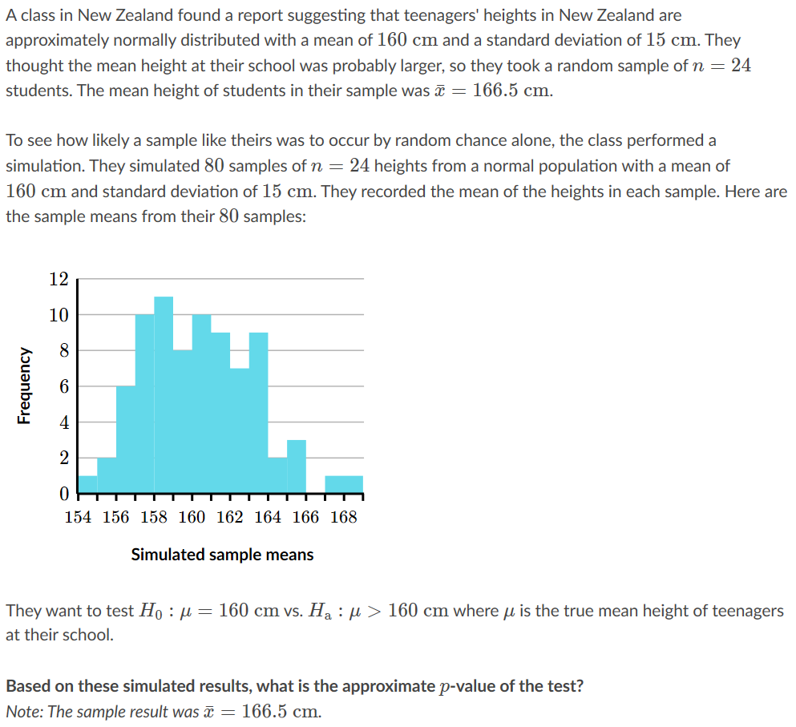
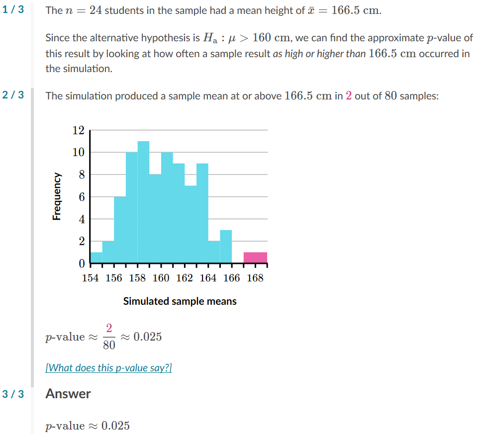

# Teenager height

## Question

## Answer

## Text
### Question
A class in New Zealand found a report suggesting that teenagers' heights in New Zealand are approximately normally distributed with a mean of 
160 cm160\text{ cm}
160 cm
160, start text, space, c, m, end text
 and a standard deviation of 
15 cm15\text{ cm}
15 cm
15, start text, space, c, m, end text
. They thought the mean height at their school was probably larger, so they took a random sample of 
n=24n=24
n=24
n, equals, 24
 students. The mean height of students in their sample was 
xˉ=166.5 cm\bar x=166.5\text{ cm}
x
ˉ
=166.5 cm
x, with, \bar, on top, equals, 166, point, 5, start text, space, c, m, end text
.
To see how likely a sample like theirs was to occur by random chance alone, the class performed a simulation. They simulated 
8080
80
80
 samples of 
n=24n=24
n=24
n, equals, 24
 heights from a normal population with a mean of 
160 cm160\text{ cm}
160 cm
160, start text, space, c, m, end text
 and standard deviation of 
15 cm15\text{ cm}
15 cm
15, start text, space, c, m, end text
. They recorded the mean of the heights in each sample. Here are the sample means from their 
8080
80
80
 samples:

00
0
22
2
44
4
66
6
88
8
1010
10
1212
12
154\small154
154
156\small156
156
158\small158
158
160\small160
160
162\small162
162
164\small164
164
166\small166
166
168\small168
168
Simulated sample means
Frequency
They want to test 
H0:μ=160 cmH_0: \mu=160\text{ cm}
H
0
​

:μ=160 cm
H, start subscript, 0, end subscript, colon, mu, equals, 160, start text, space, c, m, end text
 vs. 
Ha:μ>160 cmH_\text{a}:\mu>160\text{ cm}
H
a
​

:μ>160 cm
H, start subscript, start text, a, end text, end subscript, colon, mu, is greater than, 160, start text, space, c, m, end text
 where 
μ\mu
μ
mu
 is the true mean height of teenagers at their school.
Based on these simulated results, what is the approximate 
pp
p
p
-value of the test?
Note: The sample result was 
xˉ=166.5 cm\bar x=166.5\text{ cm}
x
ˉ
=166.5 cm
x, with, \bar, on top, equals, 166, point, 5, start text, space, c, m, end text
.

### Answer
1 / 3
The 
n=24n=24
n=24
n, equals, 24
 students in the sample had a mean height of 
xˉ=166.5 cm\bar x=166.5\text{ cm}
x
ˉ
=166.5 cm
x, with, \bar, on top, equals, 166, point, 5, start text, space, c, m, end text
.
Since the alternative hypothesis is 
Ha:μ>160 cmH_\text{a}:\mu>160\text{ cm}
H
a
​

:μ>160 cm
H, start subscript, start text, a, end text, end subscript, colon, mu, is greater than, 160, start text, space, c, m, end text
, we can find the approximate 
pp
p
p
-value of this result by looking at how often a sample result as high or higher than 
166.5 cm166.5\text{ cm}
166.5 cm
166, point, 5, start text, space, c, m, end text
 occurred in the simulation.
Hint #2
2 / 3
The simulation produced a sample mean at or above 
166.5 cm166.5\text{ cm}
166.5 cm
166, point, 5, start text, space, c, m, end text
 in 
2\maroonD{2}
2
start color #ca337c, 2, end color #ca337c
 out of 
8080
80
80
 samples:

00
0
22
2
44
4
66
6
88
8
1010
10
1212
12
154\small154
154
156\small156
156
158\small158
158
160\small160
160
162\small162
162
164\small164
164
166\small166
166
168\small168
168
Simulated sample means
Frequency
p-value≈280≈0.025p\text{-value} \approx \dfrac{\maroonD{2}}{80} \approx 0.025
p-value≈
80

2
​

≈0.025
p, start text, negative, v, a, l, u, e, end text, approximately equals, start fraction, start color #ca337c, 2, end color #ca337c, divided by, 80, end fraction, approximately equals, 0, point, 025
[What does this p-value say?]
This 
pp
p
p
-value says that when we sample 
2424
24
24
 members from a normal population with a mean of 
160 cm160\text{ cm}
160 cm
160, start text, space, c, m, end text
 and standard deviation of 
15 cm15\text{ cm}
15 cm
15, start text, space, c, m, end text
, there is about a 
2.5%2.5\%
2.5%
2, point, 5, percent
 chance that we see a sample mean as high or higher than 
166.5 cm166.5\text{ cm}
166.5 cm
166, point, 5, start text, space, c, m, end text
.
Hint #3
3 / 3
Answer
p-value≈0.025p\text{-value} \approx 0.025
p-value≈0.025
