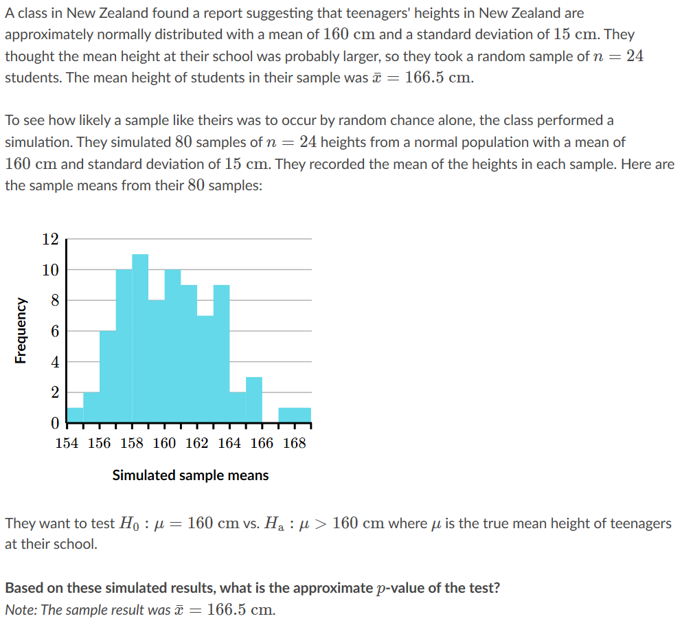

# Teenager foot length

## Question

## Answer

## Text
### Question
A class found a report suggesting that teenagers' foot lengths are approximately normally distributed with a mean of 
23 cm23\text{ cm}
23 cm
23, start text, space, c, m, end text
 and a standard deviation of 
2.6 cm2.6\text{ cm}
2.6 cm
2, point, 6, start text, space, c, m, end text
. They wondered if this held true at their school, so they took a random sample of 
n=9n=9
n=9
n, equals, 9
 students. The mean foot length of students in their sample was 
xˉ=24.6ˉ cm\bar x=24.\bar6\text{ cm}
x
ˉ
=24.
6
ˉ
 cm
x, with, \bar, on top, equals, 24, point, 6, with, \bar, on top, start text, space, c, m, end text
.
To see how likely a sample like theirs was to occur by random chance alone, the class performed a simulation. They simulated 
5050
50
50
 samples of 
n=9n=9
n=9
n, equals, 9
 lengths from a normal population with a mean of 
23 cm23\text{ cm}
23 cm
23, start text, space, c, m, end text
 and standard deviation of 
2.6 cm2.6\text{ cm}
2.6 cm
2, point, 6, start text, space, c, m, end text
. They recorded the mean of the lengths in each sample. Here are the sample means from their 
5050
50
50
 samples:

00
0
22
2
44
4
66
6
88
8
1010
10
2121
21
2222
22
2323
23
2424
24
2525
25
Simulated sample means
Frequency
They want to test 
H0:μ=23 cmH_0: \mu=23 \text{ cm}
H
0
​

:μ=23 cm
H, start subscript, 0, end subscript, colon, mu, equals, 23, start text, space, c, m, end text
 vs. 
Ha:μ≠23 cmH_\text{a}: \mu \neq 23 \text{ cm}
H
a
​

:μ

​

=23 cm
H, start subscript, start text, a, end text, end subscript, colon, mu, does not equal, 23, start text, space, c, m, end text
 where 
μ\mu
μ
mu
 is the true mean foot length.
Based on these simulated results, what is the approximate 
pp
p
p
-value of the test?
Note: The sample result was 
xˉ=24.6ˉ cm\bar x=24.\bar{6} \text{ cm}
x
ˉ
=24.
6
ˉ
 cm
x, with, \bar, on top, equals, 24, point, 6, with, \bar, on top, start text, space, c, m, end text
.

### Answer
1 / 3
The 
n=9n=9
n=9
n, equals, 9
 students in the sample had a mean foot length of 
xˉ=24.6ˉ cm\bar x=24.\bar6\text{ cm}
x
ˉ
=24.
6
ˉ
 cm
x, with, \bar, on top, equals, 24, point, 6, with, \bar, on top, start text, space, c, m, end text
.
Since the alternative hypothesis is 
Ha:μ≠23 cmH_\text{a}:\mu \neq 23\text{ cm}
H
a
​

:μ

​

=23 cm
H, start subscript, start text, a, end text, end subscript, colon, mu, does not equal, 23, start text, space, c, m, end text
, we can find the approximate 
pp
p
p
-value of this result by looking at how often a sample mean as far or farther than 
24.6ˉ cm24.\bar6\text{ cm}
24.
6
ˉ
 cm
24, point, 6, with, \bar, on top, start text, space, c, m, end text
 occurred in the simulation. We need to look for sample means this far above or below the hypothesized mean.
Hint #2
2 / 3
The sample mean 
xˉ=24.6ˉ cm\bar x=24.\bar6\text{ cm}
x
ˉ
=24.
6
ˉ
 cm
x, with, \bar, on top, equals, 24, point, 6, with, \bar, on top, start text, space, c, m, end text
 is 
1.6ˉ cm1.\bar 6\text{ cm}
1.
6
ˉ
 cm
1, point, 6, with, \bar, on top, start text, space, c, m, end text
 above the hypothesized mean of 
23 cm23\text{ cm}
23 cm
23, start text, space, c, m, end text
. The simulation produced a sample mean as far or farther than this distance in 
4\maroonD{4}
4
start color #ca337c, 4, end color #ca337c
 out of 
5050
50
50
 samples:

00
0
22
2
44
4
66
6
88
8
1010
10
2121
21
2222
22
2323
23
2424
24
2525
25
Simulated sample means
Frequency
p-value≈450≈0.08p\text{-value} \approx \dfrac{\maroonD{4}}{50} \approx 0.08
p-value≈
50

4
​

≈0.08
p, start text, negative, v, a, l, u, e, end text, approximately equals, start fraction, start color #ca337c, 4, end color #ca337c, divided by, 50, end fraction, approximately equals, 0, point, 08
[Got it, thanks!]
This 
pp
p
p
-value says that when we sample 
99
9
9
 values from a normal population with a mean of 
23 cm23\text{ cm}
23 cm
23, start text, space, c, m, end text
 and standard deviation of 
2.6 cm2.6\text{ cm}
2.6 cm
2, point, 6, start text, space, c, m, end text
, there is about an 
8%8\%
8%
8, percent
 chance that we see a sample mean as far or farther away from 
23 cm23\text{ cm}
23 cm
23, start text, space, c, m, end text
 as 
24.6ˉ cm24.\bar 6\text{ cm}
24.
6
ˉ
 cm
24, point, 6, with, \bar, on top, start text, space, c, m, end text
.
Hint #3
3 / 3
Answer
p-value≈0.08p\text{-value}\approx 0.08
p-value≈0.08
