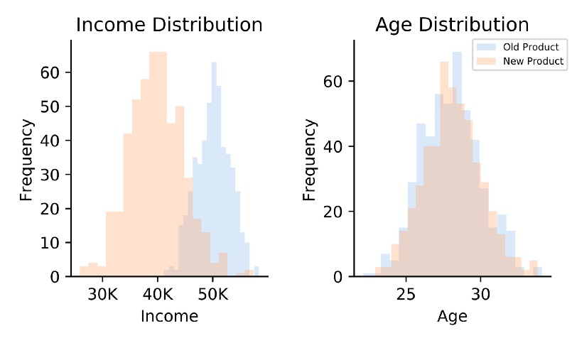
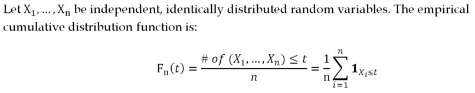
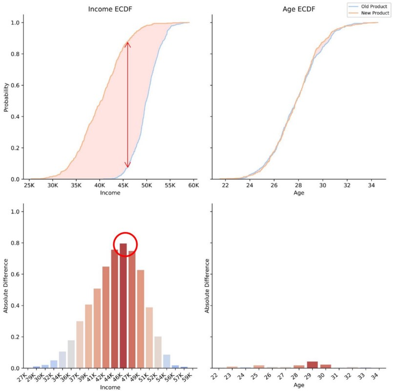
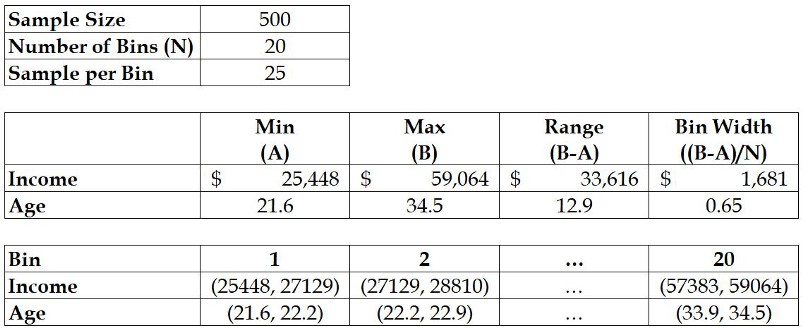
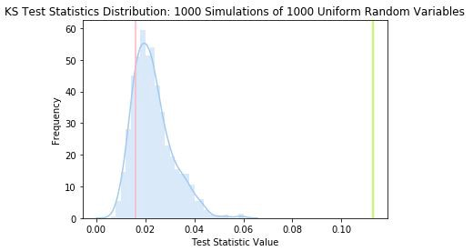
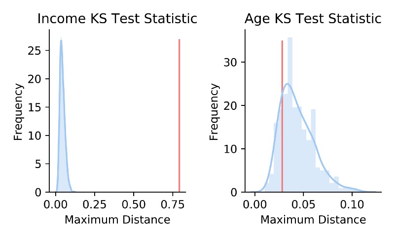

# [How to Compare Two Distributions in Practice](https://towardsdatascience.com/how-to-compare-two-distributions-in-practice-8c676904a285)
A quick guide to applying the discrete Kolmogorov-Smirnov test    
Alex Kim    
Nov 24, 2019·6 min read    

Image for post
Photo by Raquel Martínez on Unsplash

## What we will cover in this article
This article demonstrates how to conduct the discrete Kolmogorov–Smirnov (KS) tests and interpret the test statistics. As a non-parametric test, the KS test can be applied to compare any two distributions regardless of whether you assume normal or uniform. In practice, the KS test is extremely useful because it is efficient and effective at distinguishing a sample from another sample, or a theoretical distribution such as a normal or uniform distribution.

## First, why do we need to study our data?
Suppose your firm launched a new product and your CEO asked you if the new product is more popular than the old product. You conducted an A/B test and found out that the new product is selling more than the old product. Excited to share the good news, you tell the CEO about the success of the new product, only to see puzzled looks.    

    

By visual inspection, the two groups have different incomes and are of similar ages. How can we verify this?
The CEO looked puzzled because we did not deliver any stories. After all, the very last thing the CEO wants to do is discontinue the old product and sell the new one without understanding who were buying these products.

To deliver a story, we can analyze the demographic data and answer the following questions:    
* are the 2 groups of customers similar in terms of age?
* are the 2 groups of customers making similar incomes?

Answering these questions entails comparing two sample distributions, which can be done using the discrete KS test. As a result of this test, we will find out whether we should keep or discontinue the old product line.

## What is the idea behind the discrete KS test?
The idea behind the KS test is simple: if two samples belong to each other, their empirical cumulative distribution functions (ECDFs) must be quite similar. This suggests that we can evaluate their similarity by measuring the differences between the ECDFs.

To achieve this, the KS test finds the maximum distance between the ECDFs. More importantly, the test requires evaluating whether the distance is large enough to claim that the two samples do not belong to each other.

In the diagram below, the maximum distance between the income ECDFs is indicated by the red arrow. The red arrow corresponds to the KS test statistic and is shown in the red circle.

In practice, the discrete version of the KS test is often appropriate because of rounding. Although variables such as time and price are theoretically continuous, these are often considered discrete variables due to rounding, which gives us a finite set of possible values. The continuous version of the KS test can still be used although it will lead to a more conservative result (i.e. if the rejection level is 5%, the actual level will be less than 5%).

## How do we apply the discrete KS test?

The following is a procedure to conduct the discrete KS test for two samples:

### Stage 1: Binning the range
* Find the min and max of the combined sample to define our range.
* Bin the range such that there are at least 10 samples per bin: e.g. for a sample size of 500, we can expect 25 samples per bin by choosing 20 buckets.

#### Stage 1: Binning the range

### Stage 2: Counting the bin frequencies
With the set of bins from Stage 1, use the ECDF formula from the previous section to compute the frequencies of all bins for each sample.

### Stage 3: Calculating the maximum distance

For each bin, compute the difference in frequencies between the two samples.

The KS test statistic is equal to the largest difference in frequencies among all bins.

## How do we make sense of the KS test statistic?

To find out whether we can reject the null hypothesis or not, we have to derive a KS test statistics distribution using statistical techniques.

### 1. Sample distribution vs. theoretical distribution

When we compare a sample with a theoretical distribution, we can use a Monte Carlo simulation to create a test statistics distribution.

For instance, if we want to test whether a p-value distribution is uniformly distributed (i.e. p-value uniformity test) or not, we can simulate uniform random variables and compute the KS test statistic. By repeating this process 1000 times, we will have 1000 KS test statistics, which gives us the KS test statistic distribution below.

#### The red line is the actual test statistic and the green line is the test statistic for 1000 random normal variables.

By inserting the KS test statistic for the actual sample (i.e. the red line), we can see that the actual KS test statistic is contained inside the distribution. This means that there is no strong evidence against the null hypothesis that the p-value sample follows a uniform distribution.

Furthermore, the green line, which represents the KS test statistics from a simulation using 1000 normal random variables, is outside the distribution. This manifests the dissimilarity between a uniform and normal distribution.

### 2. Sample distribution vs. another sample distribution

In our earlier example with age and income distributions, we compared a sample distribution to another sample distribution instead of a theoretical distribution. In this case, we need to apply resampling techniques such as permutation tests or bootstrapping to derive a KS test statistic distribution.

In this section, we will conduct a permutation test, which involves combining both samples to randomly create new sets of two samples. With each new set, we will compute the KS test statistic and combine all of them to generate the KS test statistic distribution.

#### The red vertical line is the KS test statistic value of the two original samples.

As expected, the KS test statistic for the actual income samples is far away from the distribution. This suggests we can reject the null hypothesis that states the income samples are identical (i.e. p-value is zero). In contrast, the KS test statistic of the actual age samples is located within its KS test statistic distribution. Hence, we cannot reject the null hypothesis that states the age samples are identical.

## What we have learned

As a result of our findings, we can conclude that the new and old product may be targeting a similar age group, but different income groups. This tells us that we should not discontinue the old product and must find an optimal balance between the two products.

Aside from the KS test, there are alternatives such as the chi-square and Anderson-Darling (AD) tests, which can be found in [2]. In comparison to the KS test, which puts all emphasis on the bin with the largest difference, these alternatives allocate weights among all bins. The chi-square test allocates weights based on the expected frequencies of the bins while the AD test puts more emphasis on the tail.

I would like to encourage the readers to apply the discrete KS test or explore other alternatives as part of their analytic routines. Not only do these tests help us understand data inside out, but they also are simple to implement. There is an R package available here. Have fun and make the best of it!

## Sources
1. Elmore, K. L. (2005). Alternatives to the Chi-Square Test for Evaluating Rank Histograms from Ensemble Forecasts. Weather and Forecasting, 20(5), 789–795. doi: 10.1175/waf884.1
2. Steele, M., & Chaseling, J. (2006). Goodness-of-Fit Tests Powers of Discrete Goodness-of-Fit Test Statistics for a Uniform Null Against a Selection of Alternative Distributions.:w
